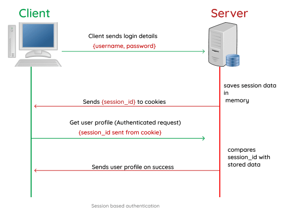

# JWT
JSON Web Token


JWT (”jot”) - JSON Web Token
Note: English speakers use ‘джат’ as well as JWT. Both of them.


JWT - is an open standard [RFC 7519](https://tools.ietf.org/html/rfc7519)

Note:JSON Web Token is an open standard ([RFC 7519](https://tools.ietf.org/html/rfc7519)) that defines a compact and self-contained way for securely transmitting information between parties as a JSON object. This information can be verified and trusted because it is digitally signed. JWTs can be signed using a secret (with the **HMAC** algorithm) or a public/private key pair using **RSA**  or **ECDSA** algorithm. <!-- In most cases, it’s an encoded JSON containing a set of claims and a signature. It’s usually used in the context of other authentication mechanisms like OAuth, OpenID to share user-related information. It’s also a popular way to authenticate/authorize users in a microservice architecture. -->


JWT can be used for **authorization** or **data exchange**.


#### Authentication vs. authorization

&nbsp;
- **Authentication**: the process of verifying who a user is (log in)
- **Authorization**: the process of verifying what they have access to  
Note:**Authentication** verifies the identity of a user or service like when user logs in. While **authorization** determines user’s access rights, for example this user has admin rights and another does not. So, as I said, JWT is used for authorization, not for authentication.


#### The old way to authorize user
## cookies and session


Note:Session based authentication is one in which the user state is stored on the server’s memory. When using a session based authentication, the server creates and stores the session data in the server memory when the user logs in and then stores the session Id in a cookie on the user browser. The session Id is then sent on subsequent requests to the server and the server compares it with the stored session data and proceeds to process the requested action.


### Problems


Note:We will come across with problems when we have multiple servers, for example, an authorization server and API server. If we store ID in cookies, cookie sets to the Authentication server. This option is not suitable for us, because we can’t send it to an API server. 


Note:The solution is to store the ID in client's local storage and send it to an API server. Here we came to another problem: API server has to check if it is a valid ID. So he asks Authentication server. This connection is not very good for us. 
What if we store signed ID on client's side?


# Here comes JWT


### JWT - token based authentication


```jsx
headers:{
"Authorization": "Bearer ${JWT_TOKEN}"
}
```

Note:Token based authentication is one in which the user state is stored on the client. This has grown to be the preferred mode of authentication for RESTful APIs. In the token based authentication, the user data is encrypted into a JSON Web Token with a secret and then sent back to the client. The JWT is then stored on the client side mostly localStorage and sent as a header for every subsequent request. The server receives and validates the JWT before proceeding to send a response to the client.  


### When should you use JSON Web Tokens?

Here are some scenarios where JSON Web Tokens are useful:

- **Authorization** - the most common scenario for using JWT. **Single Sign On**.
- **Information Exchange**  
&nbsp;  
&nbsp;  
&nbsp;  
&nbsp;  
*to tamper - to fake, to interfere, to counterfeit
Note:- **Authorization**: This is the most common scenario for using JWT. Once the user is logged in, each subsequent request will include the JWT, allowing the user to access routes, services, and resources that are permitted with that token. **Single Sign On** is a feature that widely uses JWT nowadays, because of its small overhead and its ability to be easily used across different domains.
- JSON Web Tokens also can be used in **Information Exchange**: they are a good way of securely transmitting information between parties. Because JWTs can be signed — for example, using public/private key pairs — you can be sure the senders are who they say they are. Additionally, as the signature is calculated using the header and the payload, you can also verify that the content hasn't been tampered with.


### **JSON Web Token structure**  

<!--            
<div style="font-size:0.5em; overflow-wrap: break-word; font-family: courier; font-weight: bold; width: 60%"><span style="color:red;">xxxxx</span>.<span style="color:magenta;">yyyyy</span>.<span style="color:blue; ">zzzzz</div> -->

- Header
- Payload  
- Signature  

<div style="text-align: left; font-size:0.5em; overflow-wrap: break-word; font-family: courier; font-weight: bold; width: 60%; margin:80px 0 0 120px">
<span style="color:red;"> eyJhbGciOiJIUzI1NiIsInR5cCI6IkpXVCJ9</span>.<span style="color:magenta;">eyJzdWIiOiIxMjM0NTY3ODkwIiwibmFtZSI6IkpvaG4gRG9lIiwiaWF0IjoxNTE2MjM5MDIyfQ</span>.<span style="color:blue; ">SflKxwRJSMeKKF2QT4fwpMeJf36POk6yJV_adQssw5c</span></div>

Note:In its compact form, JSON Web Tokens consist of three, separated by dots, parts, which are: header, payload, signature.
Therefore, a JWT typically looks like on this slide.
Let's break down the different parts.


### **Header**

```
{
  "alg": "HS256",
  "typ": "JWT"
}

```

Note:The header *typically* consists of two parts: the type of the token, which is JWT, and the signing algorithm being used, such as HS256 or RS256.  
This JSON will be Base64Url encoded to form the first part of the JWT.


### **Payload**

#### Claims

- **[Registered claims](https://tools.ietf.org/html/rfc7519#section-4.1)**: set of predefined claims, not mandatory but recommended: **iss** , **exp**, **sub**, **aud**, and [others](https://tools.ietf.org/html/rfc7519#section-4.1).
- **[Public claims](https://tools.ietf.org/html/rfc7519#section-4.2)**: These can be defined at will by those using JWTs.
- **[Private claims](https://tools.ietf.org/html/rfc7519#section-4.3)**: to share information between parties.  
  

Note:The second part of the token is the payload, which contains the claims. Claims are statements about an entity (typically, the user) and additional data. There are three types of claims: *registered*, *public*, and *private* claims.
- **Registered claims**: These are a set of predefined claims which are not mandatory but recommended, to provide a set of useful, inter-Operable claims. Some of them are: **iss** (issuer), **exp** (expiration time), **sub** (subject), **aud** (audience), and others.
    > Notice that the claim names are only three characters long as JWT is meant to be compact.
    > 
- **Public claims**: These can be defined at will by those using JWTs. But to avoid collisions they should be defined in the **IANA JSON Web Token Registry** or be defined as a URI that contains a collision resistant namespace.
- **Private claims**: These are the custom claims created to share information between parties that agree on using them and are neither *registered* or *public* claims.


Payload example
```
{
  "sub": "1234567890",
  "name": "John Doe",
  "admin": true
}

```

Note:The payload is then **Base64Url** encoded to form the second part of the JSON Web Token.

> Do note, that for signed tokens, this information, though protected against tampering, is readable by anyone. Do not put secret information in the payload or header elements of a JWT unless it is encrypted.
> 


### **Signature**

```
HMACSHA256(
  base64UrlEncode(header) + "." +
  base64UrlEncode(payload),
  secret)

```

Note:To create the signature part you have to take the encoded header, the encoded payload, a secret, the algorithm specified in the header, and sign that.
For example if you want to use the HMAC SHA256 algorithm, the signature will be created like on this slide.  
The signature is used to verify the message wasn't changed along the way, and, in the case of tokens signed with a private key, it can also verify that the sender of the JWT is who it says it is.


### **Putting all together**


Note:The output is three Base64-URL strings separated by dots that can be easily passed in HTML and HTTP environments, while being more compact when compared to XML-based standards such as SAML.

The slide shows a JWT that has the previous header and payload encoded, and it is signed with a secret.


jwt.io - JWT debugger


Note:If you want to play with JWT and put these concepts into practice, you can use [jwt.io Debugger](https://jwt.io/#debugger-io) to decode, verify, and generate JWTs.


# thank you 
### for watching